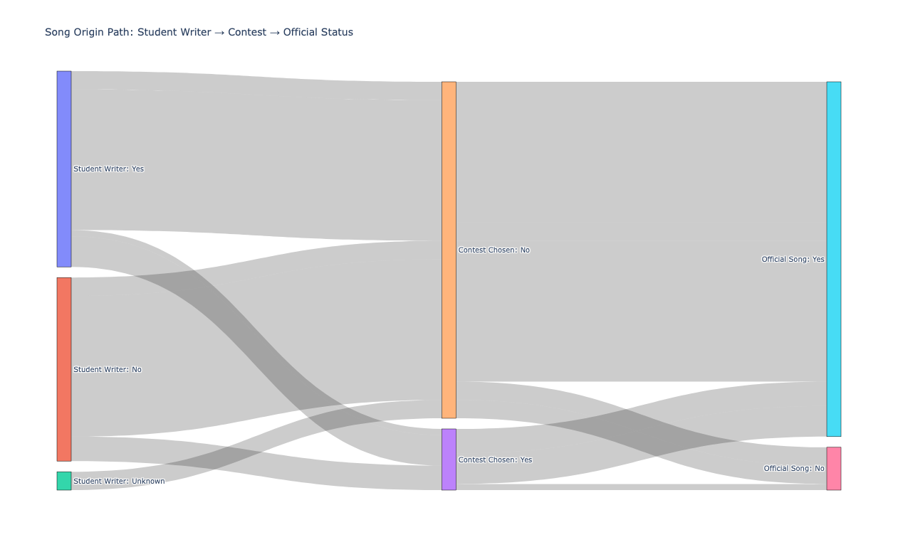
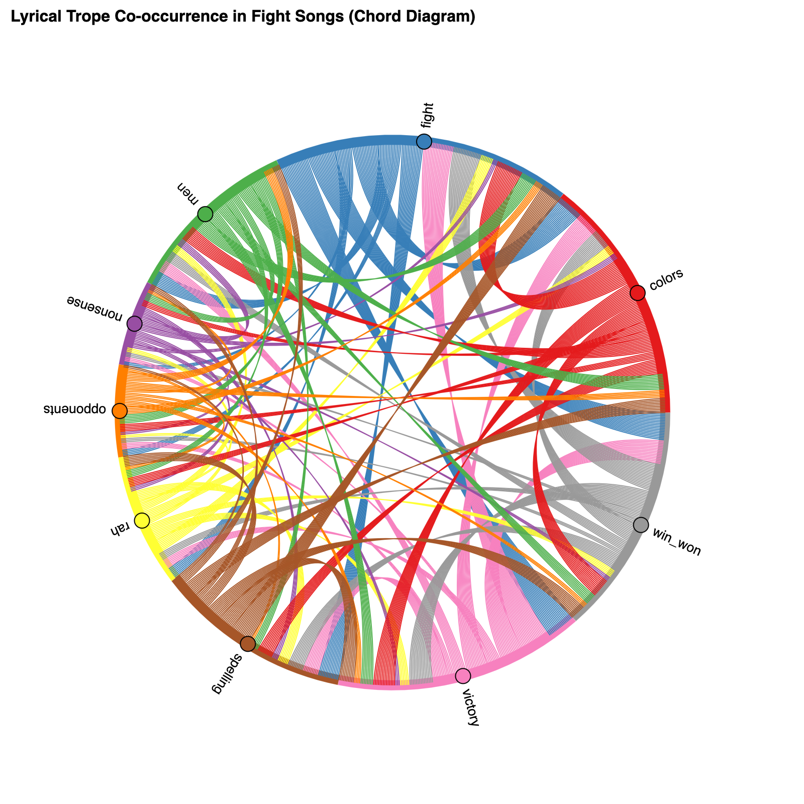
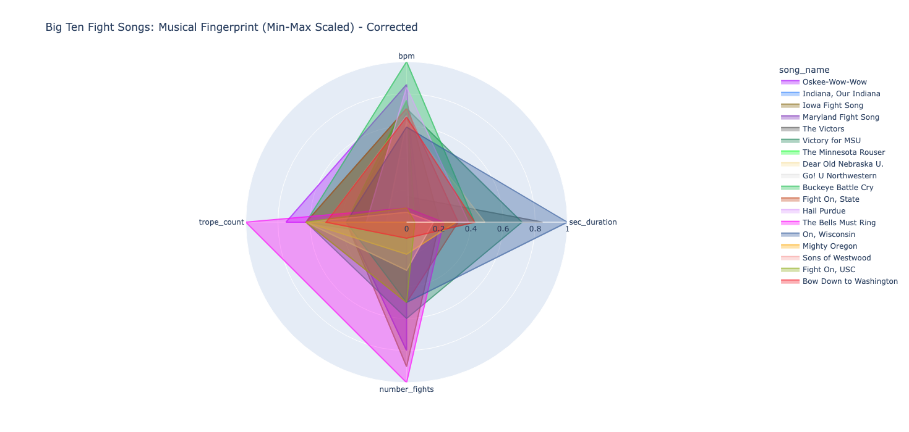

# Big10-Data-Viz: Fight Song Data Visualizations Repository

This repository hosts two advanced data visualizations analyzing the creation history and lyrical content of college fight songs from Power Five conferences. The project utilizes Python to transform raw data into specialized graph representations that reveal hidden patterns in the songs' origins and shared language.

## 1. Sankey Diagram: Song Origin Path

[Interactive Song Origin Path: Student Writer -> Contest -> Official Status](https://quickresolve.github.io/Big10-Data-Viz/sankey_diagram.html)

### Project Description & Story

This visualization maps the journey a fight song takes from its inception to official status. The flow represents three sequential decision points, which are the main stages of a song's creation history: Was the author a Student Writer? > Was the song chosen via a Contest? > Is the song the Official Song?

The diagram tells a story about the standardization of fight songs, showing that most songs—regardless of whether they were written by a student—gain official status by bypassing a formal contest. The width of the flow ribbons makes these dominant paths immediately apparent.

#### Technical Details
- Language: Python 
- Libraries: Pandas (for data aggregation), Plotly (for interactive rendering)
- Output File: [sankey_diagram_final.html](/sankey_diagram.html)

#### How to Read the Diagram
- Nodes (Boxes): The vertical columns representing the three stages ('Student Writer', 'Contest Chosen', 'Official Song').

- Ribbons (Flows): The connections between the nodes. The thickness of a ribbon is directly proportional to the total number of songs that followed that exact path.

____________________________________________________________________________________

## 2. Chord Diagram: Trope Co-occurrence

   [Interactive Lyrical Trope Co-occurrence in Fight Songs (Chord Diagram)](https://quickresolve.github.io/Big10-Data-Viz/trope_co_occurrence_chord_diagram_final_labels.html)

### Project Description & Story
This visualization explores the lyrical DNA of college fight songs by examining the co-occurrence of nine common lyrical tropes (e.g., 'fight', 'victory', 'colors', 'rah', 'nonsense'). The visualization is built on a co-occurrence matrix that tallies how many songs feature any given pair of tropes simultaneously.

The story reveals which terms are most strongly associated with one another. For example, the thick ribbons connecting 'fight' and 'victory/win' show a strong lyrical association, while the thinner links associated with terms like 'nonsense' or 'spelling' indicate they are more isolated thematically. The diagram is excellent for comparing the relative frequency of co-occurrence.

#### Technical Details
- Language: Python
- Libraries: Pandas (for matrix calculation), HoloViews (for graph visualization), Bokeh (rendering backend)
- Output File: [trope_co_occurrence_chord_diagram_final_labels.html](/trope_co_occurrence_chord_diagram_final_labels.html)

#### How to Read the Diagram
- Nodes (Segments): The colored segments around the circle, each representing one of the nine lyrical tropes.

- Ribbons (Links): The connections inside the circle. The thickness of a ribbon indicates the count of songs in which both connected tropes appear.

- Color Tracing: Ribbons inherit the color of their source node, making it easy to trace all connections originating from a single trope.

____________________________________________________________________________________

## 3. Big Ten Fight Songs: Musical Fingerprint

[Interactive Big 10 Musical Fingerprint Polar Plot](https://quickresolve.github.io/Big10-Data-Viz/big_ten_musical_fingerprint_radar_chart_key.html)

### Project Description & Story
The Big Ten Musical Fingerprint is a Radar Chart visualization comparing the unique musical and lyrical profiles of all 18 Big Ten fight songs.The story behind the visualization is to quantify the blend of lyrical aggression and musical pace across the conference. The fingerprint is built using four key metrics: BPM (tempo), Song Duration (seconds), 'Fight' Word Count, and Total Trope Count (lyrical complexity). Because these metrics are on different scales, they were standardized using Min-Max Scaling (0 > 1) to ensure fair comparison.

#### Technical Details
- Language: Python
- Libraries: Pandas (for data preparation), SKLearn (for min-max scaling), and Plotly (for interactive chart rendering)
- Output File: [big_ten_musical_fingerprint_radar_chart_key.html](/big_ten_musical_fingerprint_radar_chart_key.html)

#### How to Read the Diagram

To read the diagram, look at the shape formed by each song's line, which represents its unique "fingerprint." Each point on the axis is a scaled value between $0$ (lowest score among Big Ten songs) and $1$ (highest score).

- Large, wide shapes indicate songs that score highly across multiple metrics.
- A point extending towards the outer edge on the 'BPM' axis indicates a fast song.
- A point extending towards the outer edge on the 'Trope Count' axis indicates a lyrically complex or dense song.

By examining the orientation of the shape, you can instantly infer a song's dominant characteristics relative to its rivals.